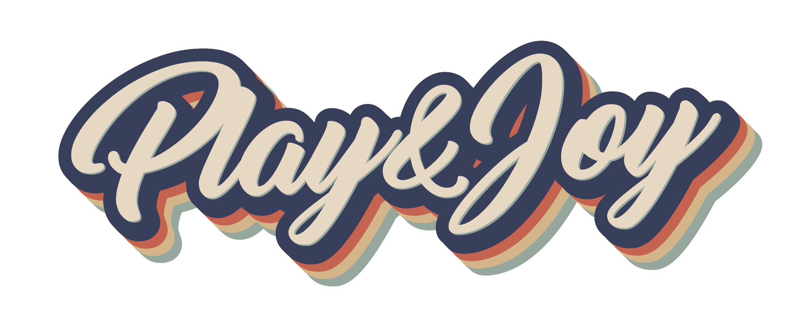

---

## ✔<u>Temática del sitio</u>

Después de una investigación realizada por el equipo y juntando nuestros intereses personales, decidimos que nuestro sitio de e-commerce se llamará ***Play&Joy*** un sitio donde te unirás mediante una suscripción mensual y le llegará a cada usuario según el plan elegido una caja que consta de un disco de vinilo o libro, más una bebida que puede ser café de especialidad o un vino. 
Nuestro objetivo es que aquellos que se unan, puedan vivir una experiencia que deleite todos los sentidos. En nuestras suscripciones le pediremos al cliente que seleccione el tipo de bebida que le gusta o lo que toma usualmente, también el género musical o de lectura para conocer más el perfil del mismo, para que mes a mes nos siga eligiendo. 
Al mismo tiempo, en nuestra tienda podrán encontrar todo lo necesario para llevar a cabo esta experiencia. Desde cafeteras, bandejas para discos hasta copas y cavas.
Estos productos contarán con descuentos exclusivos para suscriptores.

https://s3.amazonaws.com/mercado-ideas/wp-content/uploads/sites/2/2017/08/29185233/botellas-todas-640x202.png
https://www.newscafe.es/wp-content/uploads/2020/02/cafe-xxx-1.jpg
https://www.lavanguardia.com/r/GODO/LV/p5/WebSite/2018/02/19/Recortada/img_rpeco_20180219-142613_imagenes_lv_otras_fuentes_istock-108195157-kGfE-U44920520729RIE-992x558@LaVanguardia-Web.jpg

### Planes de suscripción:

#### **<u>Full:</u>**  
- 1 Vino 🍷
- 1 Café ☕
- 1 Disco 🎸
- 1 Libro 📖

#### **<u>Básico:</u>**  
- 1 Libro o Disco 
- 1 Vino o Café

#### **<u>A Medida:</u>**   
El cliente seleccionará los productos a los que quiera suscribirse.

## ✔<u>Público objetivo</u>

Nuestro público objetivo está orientado a hombres y mujeres de entre 30 y 60 años aproximadamente. 

## ✔<u>Estética del sitio</u>

Dada la temática del sitio y el público al que se apunta, optamos por elegir una estética retro inspirada en la década de los 80.
¿Por qué elegimos esta década?  
Porque evoca a una época percibida como más sencilla, estable y auténtica. 
Los niños de los ochenta son ahora los consumidores de mediana edad propensos a dejarse llevar por la nostalgia como impulso al consumo.

#### Listado de 5 páginas referentes:

https://somosclubdecafe.com/

Puntos de referencia:
- Home
- Suscripciones
- Detalle producto
- Carrito de compras
- Informacion relevante sobre los diferentes tipos de cafe y sus moliendas

https://www.ladobmusica.com.ar/

Puntos de referencia:
- Formulario de Registro.
- Formulario de Login pop-up.

https://www.bacan.com.ar/#/women/step/style

Puntos de referencia:
- Formulario de Suscripción atractivo, dinámico y simple.

https://www.bonvivir.com/suscripcion/

Puntos de referencia:
- Formulario de Suscripción sobre vinos
- Informacion relevante sobre vinos.

https://bukku.com.ar/

Puntos de referencia:
- La idea de una experiencia que combinara sentidos. En este caso, libros y música.
“Suscribiéndote a Bukku recibirás una vez al mes una novedad literaria junto con regalos para hacer única la experiencia y una Playlist seleccionada especialmente para acompañar cada lectura.”

---

About Us:

Noelia "La Revelde⭐" Carosella

Alberto "Pappo🤟" Simonetti

Emilia Quintana
